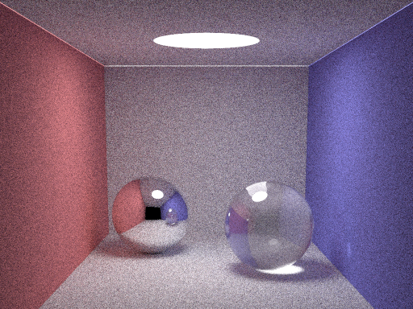

# Rust Smallpt

A very simple implementation of [smallpt](https://www.kevinbeason.com/smallpt/).

# Results

# How to run it?

- `cargo run` in the root directory

# Arguments

- Sample per pixel: `main.rs:20`
  - Default: `100(*4)`
- Image width: `main.rs:20`
  - Default: `512`
- Image height: `main.rs:20`
  - Default: `384`
- N workers: `camera.rs:32`
  - Default: `16`